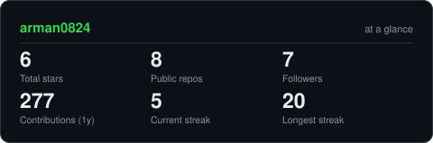
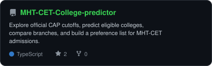
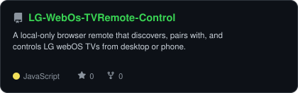
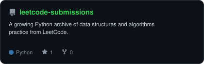
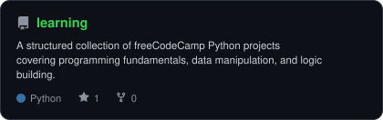

<!-- Generated from assets/profile-source.png with scripts/dotify.py. -->

 

 

---

  
## `01 / snapshot`

Hi, I'm **Arman Singh**, a computer science undergraduate in Mumbai. Currently learning new languages
and exploring more about AI/ML.

- Built **[CET Vault](https://cet-vault.vercel.app)** **[Agentic-AI](https://github.com/arman0824/Bog)**
- Practicing data structures and algorithms in **Python** and **c++**
- Exploring applied **AI/ML** and new programming languages
- Keeping a running record of what I learn in **[learning](https://github.com/arman0824/learning)**

---

## `02 / toolkit`

---

## `03 / current focus`

<table>
<tr>
<td width="50%" align="center" valign="middle">

<!-- Edit assets/skills.json to tune this self-rated learning map. -->
<picture>
  <source media="(prefers-color-scheme: dark)" srcset="assets/radar-dark.svg">
  <source media="(prefers-color-scheme: light)" srcset="assets/radar-light.svg">
  
</picture>

</td>
<td width="50%" align="center" valign="middle">

<!-- Curated language focus - edit assets/languages.json to tune it. -->
<picture>
  <source media="(prefers-color-scheme: dark)" srcset="assets/radar-langs-dark.svg">
  <source media="(prefers-color-scheme: light)" srcset="assets/radar-langs-light.svg">
  
</picture>

</td>
</tr>
</table>

---

## `04 / contribution trail`

<picture>
  <source media="(prefers-color-scheme: dark)" srcset="https://raw.githubusercontent.com/arman0824/arman0824/output/snake-dark.svg">
  <source media="(prefers-color-scheme: light)" srcset="https://raw.githubusercontent.com/arman0824/arman0824/output/snake.svg">
  
</picture>

---

## `05 / the numbers`

<picture>
  <source media="(prefers-color-scheme: dark)" srcset="assets/card-stats-dark.svg">
  <source media="(prefers-color-scheme: light)" srcset="assets/card-stats-light.svg">
  
</picture>

 

 

---

## `06 / selected builds`

<table>
<tr>
<td width="50%">
  <a href="https://github.com/arman0824/MHT-CET-College-predictor">
    <picture>
      <source media="(prefers-color-scheme: dark)" srcset="assets/card-MHT-CET-College-predictor-dark.svg">
      <source media="(prefers-color-scheme: light)" srcset="assets/card-MHT-CET-College-predictor-light.svg">
      
    </picture>
  </a>
</td>
<td width="50%">
  <a href="https://github.com/arman0824/LG-WebOs-TVRemote-Control">
    <picture>
      <source media="(prefers-color-scheme: dark)" srcset="assets/card-LG-WebOs-TVRemote-Control-dark.svg">
      <source media="(prefers-color-scheme: light)" srcset="assets/card-LG-WebOs-TVRemote-Control-light.svg">
      
    </picture>
  </a>
</td>
</tr>
<tr>
<td width="50%">
  <a href="https://github.com/arman0824/leetcode-submissions">
    <picture>
      <source media="(prefers-color-scheme: dark)" srcset="assets/card-leetcode-submissions-dark.svg">
      <source media="(prefers-color-scheme: light)" srcset="assets/card-leetcode-submissions-light.svg">
      
    </picture>
  </a>
</td>
<td width="50%">
  <a href="https://github.com/arman0824/learning">
    <picture>
      <source media="(prefers-color-scheme: dark)" srcset="assets/card-learning-dark.svg">
      <source media="(prefers-color-scheme: light)" srcset="assets/card-learning-light.svg">
      
    </picture>
  </a>
</td>
</tr>
</table>

